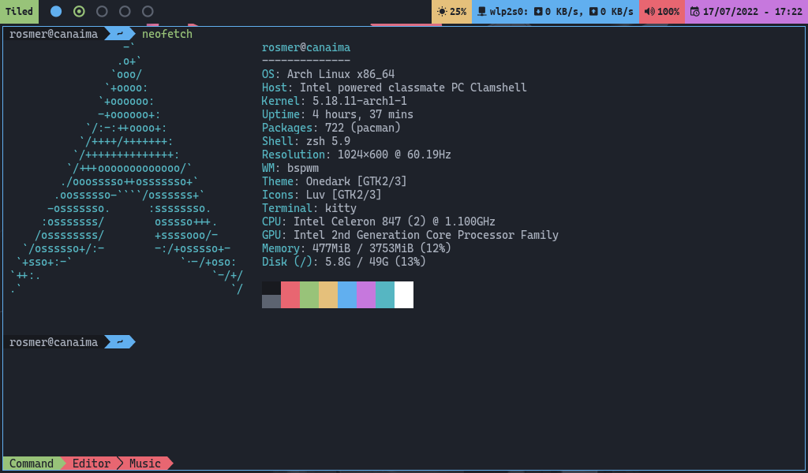
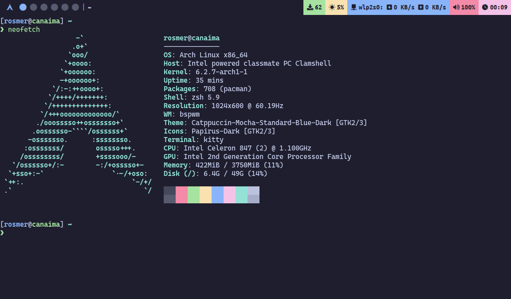

# :computer: Dotfiles & Configs

### Hi there! Thanks for dropping by! :zap:

Welcome to this repository containing my custom configurations of popular window managers and programs, since I decided to switch to **Arch Linux** I've been learning about customizing desktop environments until I came up with what is shown here.Currently configurations cannot be installed through a bash script. The documentation is not very good either, but I will improve it as I learn.

### I hope you like it! :v:

---

---
