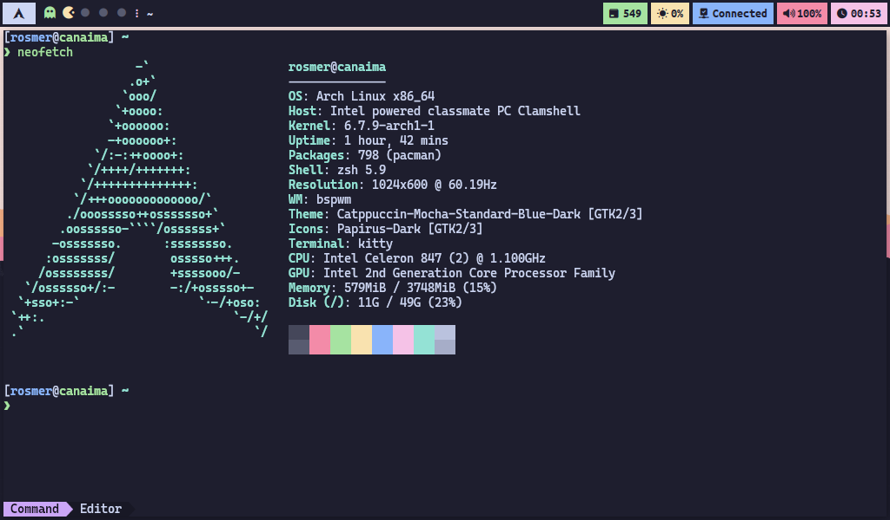

# :computer: Dotfiles & Configs

### Hi there! Thanks for dropping by! :zap:

Welcome to this repository containing my custom configurations of popular window managers and programs, since I decided to switch to **Arch Linux** I've been learning about customizing desktop environments until I came up with what is shown here.Currently configurations cannot be installed through a bash script. The documentation is not very good either, but I will improve it as I learn.

### I hope you like it! :v:

---

# :bookmark_tabs: Information

Here are some details about my setup:

- **OS:** [Arch Linux](https://archlinux.org/)
- **WM:** [Bspwm](https://github.com/baskerville/bspwm)
- **Shell:** [Zsh](https://www.zsh.org/)
- **Terminal:** [Kitty](https://sw.kovidgoyal.net/kitty/)
- **Editor:** [Neovim](https://github.com/neovim/neovim)
- **Compositor:** [Picom](https://github.com/yshui/picom)
- **Application Launcher:** [Rofi](https://github.com/davatorium/rofi)
- **Music Player:** [Ncmpcpp](https://github.com/ncmpcpp/ncmpcpp) + [Mpd](https://www.musicpd.org/)

For more information on how to configure **Bspwm** correctly on **Arch Linux**, you can visit their documentation on the [Wiki](https://wiki.archlinux.org/title/Bspwm).
